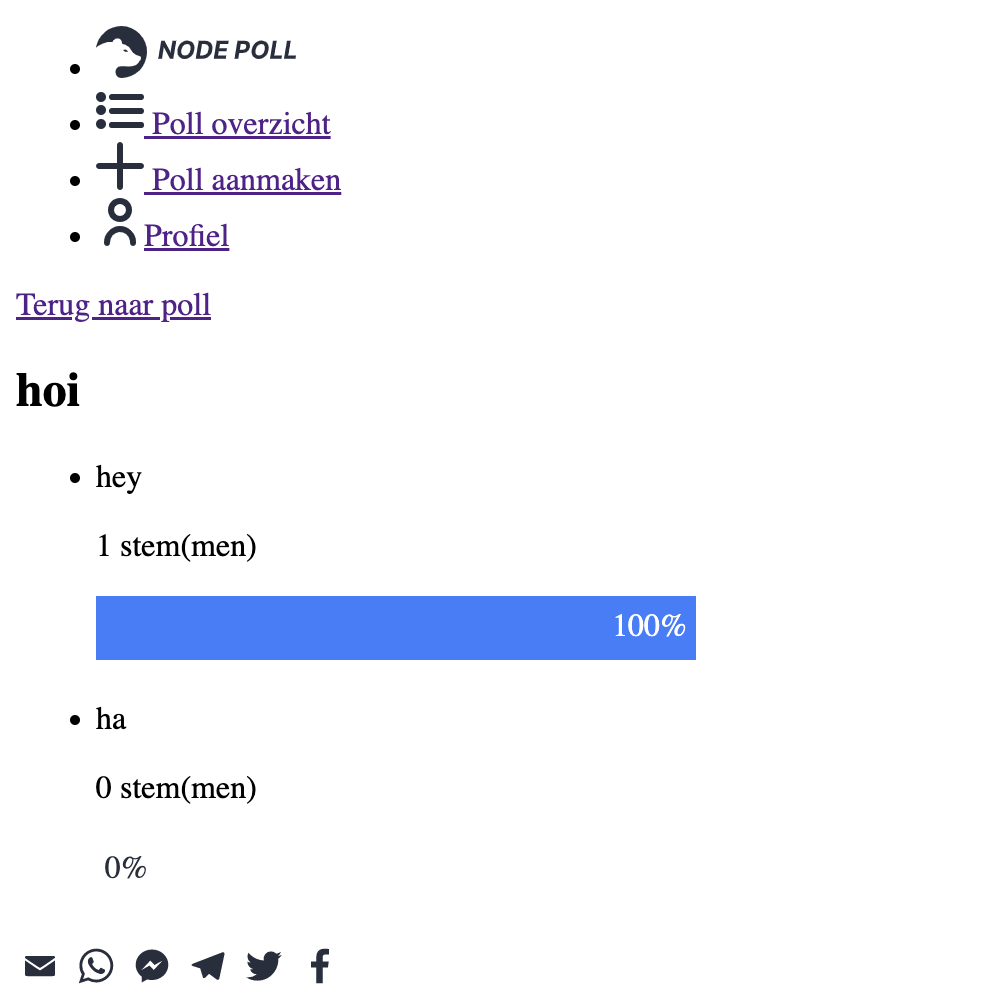

<!-- in wiki -->

# ❄️ Node Poll


## 🌟 Over Node Poll

Met Node Poll kun je polls aanmaken met één of meerdere opties, polls versturen, resultaten visueel inzien & polls opslaan als concept. Ook kun je op de overzichtspagina polls van andere mensen kijken en beantwoorden.

## 📝 Table of contents

-   User Story
-   Features
-   Live demo
-   Todo's
-   Wireflow
-   Browsers getest
-   Testverslag
-   Progressive enhancement
-   License

## 📖 User Story

Ik wil tijdens een college aan studenten een poll kunnen voorleggen met vragen en antwoorden, en de resultaten meteen laten zien.

## 🛠 Features

-   Polls aanmaken
-   Polls delen met anderen
-   Resultaten visueel inzien
-   Polls opslaan als concept
-   Aangeven of 1 of meerdere antwoorden gegeven kunnen worden
-   Mobiele & desktop versie

## 🌐 Live demo

Probeer de applicatie zelf uit op: https://node-poll-bt.herokuapp.com/

## ✅ Todo's

-   Door middel van cookies, ip, etc. voorkomen dat gebruikers meerdere keren kunnen stemmen en hiermee zorgen dat alleen je eigen concepten worden weergegeven
-   Form validation op front-end voor oude browsers

## 📐 Wireflow

<p float="left">


</p>

## 🖥️ Browsers getest

-   Brave/Chrome MacOS
-   Safari MacOS
-   Firefox MacOS
-   Safari IOS 5.0, 6.1 & 15.3
-   Revolution default browser

## 🧪 Testverslag

Toen ik eenmaal een stabiele versie op mijn eigen device had was het tijd om te testen op oudere devices. Ik begon met de iPod Touch met IOS 6.1. Toen ik hem voor het eerst hierop opende zag ik zowat niks. Alles was door de war en de helft lag buiten beeld. Het was ook niet zo 1, 2, 3 te zien waar dit aan lag.

### 📦 Flexbox

Ik kwam erachter dat dit waarschijnlijk door flexbox kwam. Caniuse.com zei dat het zou moeten werken met de `-webkit-` pre-fix. Dit werkte echter helemaal niet. Na verder te kijken kwam ik erachter dat je de oude flexbox specificatie moest gebruiken. Deze ziet er als volgt uit:

```css
/* Normale syntax */
display: flex;
flex-direction: column;
align-items: center;
justify-content: flex-start;

/* Oude syntax met -webkit- */
display: -webkit-box;
-webkit-box-orient: vertical;
-webkit-box-direction: normal;
-webkit-box-align: center;
-webkit-box-pack: start;
```

Na dit toe te passen zag het er al een stuk beter uit. Alleen dingen zoals `flex-wrap` en `justify-content: space-between` werkte niet helemaal lekker, maar dit maakte voor mijn app niet echt uit.

### 🔅 Filter

Ook had ik `filter: grayscale();` gebruikt in css om de menu items die niet actief zijn grijs te maken. Dit werkte in deze oude browser niet. Dit heb ik gefixt door de SVG's te fillen met een grijze of blauwe kleur, afhankelijk van de class. Dit werkte wel.

### 🆕 ES6

Van mijn JavaScript werkte niks meer. Na heel veel proberen kwam ik erachter dat er in mijn script tag `type=module` stond. Dit zorgde ervoor dat het script niet werkte. Vervolgens werkte mijn code nog steeds niet echt, omdat ik dingen zoals `.remove()` en `.append()` gebruikte. Dit is gefixt door `.removeChild` en `.appendChild` te gebuiken. Dit werkte blijkbaar wel. Ook liep het gebruik van `const` en `let` niet lekker, dus ik besloot alles te veranderen naar `var`, en ook dingen zoals arrow functies te vervangen voor normale syntax.

### 🔛 VW

Nu alles werkte op deze iPod kwam ik erachter dat er nog een iPod was, die een oudere IOS had, namelijk 5.0. Ik wilde ook hierop testen en toen kwam ik erachter dat mijn nav-bar weer kapot was. Echter was dit snel gefixt, ik zag namelijk dat ik `100vw` had gebruikt en dit niet ondersteund werd. Gelukkig werkte `100%` ook gewoon en was het gefixt.

Hierna heb ik nog op andere devices getest. Hierop werkte na deze aanpassingen alles perfect.

## 📈 Progressive enhancement

### 📄 HTML

<p float="left">



</p>

Met Alleen HTML is de applicatie nog steeds goed te gebruiken. Alle functionaliteiten werken nog zoals met CSS/JS, het ziet er alleen niet aantrekkelijk uit. Omdat ik gebruik maak van SVG's heb ik de SVG's in een lage resolutie geëxporteerd. Dit maakt voor de kwaliteit niks uit aangezien het een vector is maar dit zorgt dat ze zonder CSS niet de hele pagina bedekken maar slechts een aantal pixels.

### 📰 HTML + CSS

<p float="left">


</p>

Wanneer CSS aan staat wordt de applicatie een stuk overzichtelijker en makkelijker te gebruiken. De functionaliteiten werken hetzelfde, het is alleen een stuk betere ervaring. Je ziet duidelijk onderscheid tussen primaire en secundaire knoppen, en je kunt nu ook gemakkelijk zien op welke pagina je zit door middel van de SVG'tjes die blauw kleuren als de pagina actief is.

### 📜 HTML + CSS + JS

<p float="left">


</p>

Wanneer JavaScript aan staat wordt de ervaring nog wat beter. In plaats van dat je alle antwoord velden ziet (ingesteld op max. 6 antwoorden) zie je nu standaard 2 velden. Mocht je meer velden willen toevoegen, dan heb je daar een knop voor. Ook kun je deze velden weer verwijderen (totdat er weer minimaal 2 zijn). Zo voorkom je dat je onnodig veel antwoord velden ziet als je bijvoorbeeld maar 3 antwoord mogelijkheden wil hebben. Alleen de eerste 2 velden zijn `required`, mocht je andere velden leeglaten dan wordt dat op de server gefixt. Dit verbeterd dus de gebruikerservaring.

## 🔏 License

MIT
